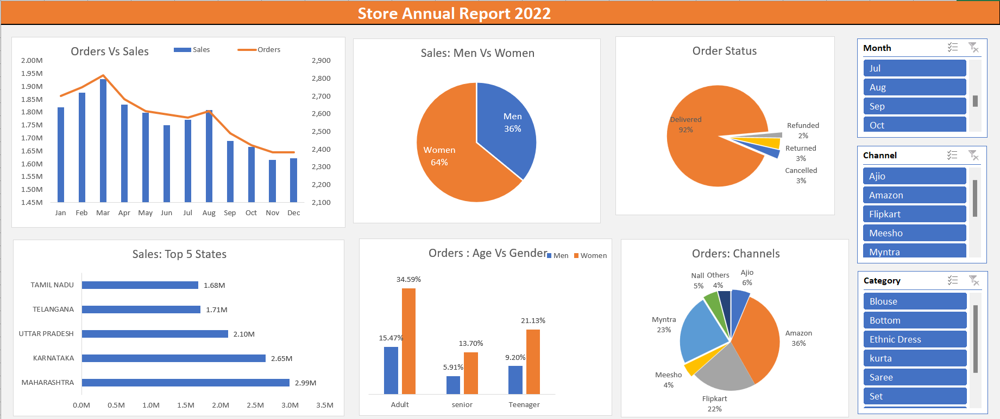

# Exel-KPI-Projects
 

## Project Name - Store-Data-Analysis

## LINKS: 

Lets Connect

[Go to my LinkedIn](https://www.linkedin.com/in/nitesh-gautam-2a7a87209/) 🌐

## TECHNOLOGIES USED:

    •	Excel

    •	MySQL | SQL Server

    •	Statistics
    
   ## STEPS:

    i) Data subset collected from online.
    ii) Data Cleaning & Finding Missing values
    iii) Data Processing 
    iv) Data Analysis / Bussiness Case Study Analysis.

    
## DATA VISUALIZATION: 

    1) Compare the sales and orders using combo Chart.
    
    2) Vertical Bar Graph top 5 contibuting to the sales.
    
    3) Horizontal Bar Graph of Relation Between age and gender based on number of orders.
    
    4) pie Chart for who purchase more men or women.
    
    5) pie chart show which channels is contributing maximum sales. 
    
    6) Use Slicing for dyanmic performance on category , months , Channels.

## DASHBOARD:
    
  ''

## METHODOLOGY:

 A Store Wants to create ana annual sales report for 2022 . So that, Store can uderstand their customers and grow more sales in 2023.

 ## NOTE:

I have uploaded all the files, datasets, icons above. Feel free to use this Project's resourses for your next Project. If you like this Project give it a Star or just tell me. It'll make me feel Good :)

[Go to my LinkedIn](https://www.linkedin.com/in/nitesh-gautam-2a7a87209/) 🌐
    

